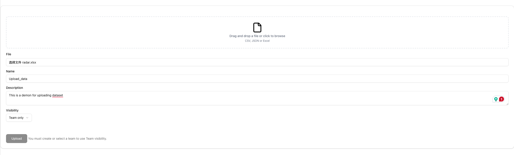

# Collaborative Data Analysis Platform Final Report

## ✏️ Team Information

- **Yifan Yang**  
  - Student Number: 1011797619  
  - Email: erik.yang@mail.utoronto.ca

- **Zhengyang Liang**  
  - Student Number: 1010239225  
  - Email: zy.liang@mail.utoronto.ca

- **Yilin Huai**  
  - Student Number: 1001297036  
  - Email: yilin.huai@mail.utoronto.ca
  
- **Feiyang Fan**  
  - Student Number: 1005146913
  - Email: feiyang.fan@mail.utoronto.ca

---

## ⚡️ Motivation

In collaborative data science projects, teams often struggle with scattered tools, inconsistent dataset versions, and inefficient communication. While there are existing platforms, many are either too costly, overly complex, or lack the flexibility needed for educational or small-team environments. This motivated us to build a streamlined, web-based platform that allows data scientists to upload datasets, create visualizations, and collaborate in real-time within a centralized workspace.

This project not only addresses a practical need in data analysis workflows but also allows us to gain hands-on experience with modern full-stack development tools, such as Next.js, PostgreSQL, and cloud storage, in a realistic and technically challenging context.

---

## 🎯 Objectives

Our goal is to develop a full-stack web application that empowers teams to collaborate on data analysis efficiently. The main objectives include:

- Implement user authentication and team-based workspace management to support secure and organized collaboration.

- Enable dataset upload and preview with support for CSV, Excel, and JSON formats.

- Provide data visualization tools using libraries like Chart.js, along with interactive table views.

- Support sharing permissions, commenting on visualizations, and metadata management to enhance collaboration and clarity.

- Ensure a responsive and intuitive user interface using Next.js, Tailwind CSS, and shadcn/ui, backed by a robust PostgreSQL database and cloud file storage.

By fulfilling these objectives, we aim to build a platform that not only meets the course’s technical requirements but also delivers real-world value to users.


---

## 🛠️ Technical Stack

Our project follows the **Next.js Full-Stack Architecture**, utilizing **Next.js 15+ with the App Router** for both frontend and backend logic. We use **Server Components**, **API Routes**, and **Server Actions** for a seamless full-stack experience.

### 📃 Frontend

- **Framework**: [Next.js 15](https://nextjs.org/) with App Router (app directory structure)
- **UI Library**: [React 19](https://react.dev/)
- **Styling**: [Tailwind CSS 4](https://tailwindcss.com/) with utility-first styling
- **Component Library**: [shadcn/ui](https://ui.shadcn.com/) and [Radix UI](https://www.radix-ui.com/) primitives for accessible, customizable UI components
- **Icons**: [Lucide React](https://lucide.dev/)
- **Data Visualization**: [Chart.js](https://www.chartjs.org/) via `react-chartjs-2`, and `chartjs-plugin-datalabels` for enhanced charts
- **Form Handling**: `react-hook-form` with schema validation via `zod`
- **File Uploads**: [UploadThing](https://uploadthing.com/)
- **State & Theme**: `next-themes` for dark/light theme toggling and `better-auth` for lightweight auth integration
- **CSV/Excel Parsing**: `papaparse` and `xlsx` libraries

### 📊 Backend

- **Server Logic**: Next.js Server Components and API Routes
- **Authentication**: [NextAuth.js v5](https://authjs.dev/)
- **Database**: [PostgreSQL](https://www.postgresql.org/) with [Prisma ORM](https://www.prisma.io/)
- **Cloud File Storage**: [AWS S3](https://aws.amazon.com/s3/) using `@aws-sdk/client-s3`, `presigned-post`, and `request-presigner`
- **Password Hashing**: `bcryptjs`

### 🔧 Development & Tooling

- **Language**: TypeScript
- **Linting**: ESLint with `eslint-config-next`
- **ORM & DB Management**: Prisma with CLI tools and custom seed scripts
- **Middleware**: Custom `middleware.ts` for request handling (e.g., route protection)
- **Deployment**: Configured for modern deployment platforms like Vercel


---

## ✨ Features

Our platform enables data scientists and teams to collaborate on datasets, visualize insights, and manage shared workspaces with ease.

### 🔐 User Authentication & Team Management
- Sign up, log in, and securely manage sessions.
- Create teams, invite members, manage roles (owner/member).
- Route protection via middleware to ensure secure access.

### 📂 Dataset Upload & Storage
- Upload datasets in **CSV**, **JSON**, or **Excel** formats.
- Files are renamed for uniqueness and stored via **S3-compatible cloud storage**.
- Metadata (name, description, visibility) is stored in **PostgreSQL**.

### 📊 Data Visualization
- Build charts using **Chart.js**: bar, line, pie, radar, and bubble.
- Customize chart title, legend, animations, and appearance.
- Edit data as raw JSON and instantly update charts.

### 📁 Data Table View
- Preview datasets in a clean, sortable, filterable table.
- Helps users quickly inspect uploaded data before visualizing.

### 📝 Metadata Management
- Owners can edit dataset details like name, description, and visibility.
- Visibility options: `Private`, `Public`, or `Team-only`.

### 🔒 Sharing & Permissions
- Access control based on dataset visibility and team membership.
- `Team` visibility automatically links datasets to the selected team.

### 💬 Comments & Annotations
- Teams can collaborate by commenting on charts and datasets.
- Enhances team communication and shared insights.

### 📤 Export Visualizations
- Export any chart as **PNG** or **JPG** using one-click export buttons.
- Supports integration into reports or external presentations.

### 👥 Team Collaboration & Management
- Create and manage multiple **teams**
- Invite other users via **user name and email-based search**
- Add/Remove team members and Disband team (Owner Only)
- Share datasets within teams using **TEAM visibility mode**
---

### How We Meet the Project Requirements

Our application meets **all core technical requirements** defined by the course:

- **Frontend**: Built with **Next.js 13+ App Router**, styled using **Tailwind CSS**, and uses **shadcn/ui** components for clean, accessible UIs.
- **Responsive Design**: Implemented using **Tailwind CSS** with mobile-first layouts and adaptive components across all pages.
- **Backend**: Uses **Next.js API Routes** for data handling, and server logic for mutations (dataset edits, team management, etc.).
- **Server Actions / Mutations**: Dataset metadata updates, team member additions/removals, and dataset creation are all handled via server-side actions or APIs.
- **Database**: All user, dataset, team, and visualization metadata is stored in **PostgreSQL**.
- **Cloud Storage**: Uploaded files are stored in an **S3-compatible** cloud bucket, and integrated with upload + metadata flow.

### Advanced Features Implemented

- ✅ **User Authentication & Authorization**  
  Login/signup with protected routes, session state, and role-based UI.

- ✅ **File Handling & Processing**  
  Upload and parse **CSV**, **JSON**, and **Excel** files using Papaparse & SheetJS.

- ✅ **API Integration with External Services**  
  Files stored via **S3-compatible API**, plus **OAuth-based** session validation via `/api/auth/get-session.

- ✅ **Advanced State Management**  
  Global `TeamContext` shares active team across pages (e.g., upload, metadata, visualizations).


---

## 📘 API Documentation

Our project provides a well-structured and fully documented RESTful API to support all core features of the Collaborative Data Analysis Platform.

The API is organized into several logical modules:

- **Authentication:** Sign in/out, session handling, and OAuth login.
- **Dataset Management:** Upload, list, view, and update dataset metadata and files.
- **Visualizations:** Create and retrieve chart visualizations linked to datasets.
- **Comments:** Comment on visualizations for team-based collaboration.
- **Team Management:** Create teams, add/remove members, and assign roles.
- **Cloud Storage:** Secure file uploads and downloads via S3 signed URLs.
- **User Search:** Search users to invite to teams or projects.

👉 For full details including request formats, parameters, response examples, and error codes, see: [`docs/API.md`](https://github.com/Tasselyy/collaborative-platform/blob/table_view/docs/API.md)

---
## 📁 Prepared Files for testing

We provide a list of files in different extension (**csv**, **json**, **xlsx**) for the users to test our visualization. For each of visualization types (**line**, **bar**, **radar**, **bubble**, **pie**), we prepare some files for testing. You can find them in the `assets` folder. All file names are in the format of `{visualization_type}.{ext}`.

---
## User Guide

### Signing Up and Logging In
We use **OAuth-only login** — no passwords required.

1. Click **Login** on the home page.
2. Choose either **GitHub** or **Google** as your sign-in provider.
3. On your **first login**, a user account will be automatically created in the system.
4. For all future logins, you’ll be logged in automatically using the same provider.

> 💡 Make sure to use the **same GitHub or Google account** every time to access your user data.

### 🧭 Navigating the Workspace Dashboard

Once you're logged in, you'll land on the **Workspace Dashboard**.
### ⌚️ Dashboard Overview
When navigating to the dashboard area, three sections are displayed. Users can click the button to choose their services.

- **Upload Dataset**: Select 1. upload your dataset.
- **Dataset Overview**: Select 2. View Your Datsets.
- **Visualization**: Selection 3. Create Visualizations.


### 🧱 Sidebar Overview
- On the **left sidebar**, you’ll find the main navigation.
- At the **top**, there is a **Team Switcher**:
  - If you don’t have any teams yet, click it to **create a new team**.
- Underneath is the **Teams section**:
  - It lists all the teams you are currently a member of.
  - At the bottom, there’s a **"Create New Team"** button to create a new team anytime.
- Under the **Platform > Data Analysis** section in the sidebar, you can access:
  - **Dataset Table View**
  - **Visualization**
  - **Upload**

### 🛠️ Creating a Team
1. On the **Create Team** page:
   - Enter a name for your team.
   - Use the **search bar** to find users by name or email.
   - Press **Enter** or click **Search** to display matching users.
   - Click a user to add them as a member.  
     They will appear under **Selected Members**.
   - To **remove** a user:
     - Click them again in the search list **or**
     - Click their name under **Selected Members**.

2. When you're ready, click **"Create Team"** to finalize the team.


### 👥 Team Management
- Click on a team name under **Your Teams** to open the **Team Management Page**.
- This page shows:
  - Basic team metadata
  - A list of all members

- If you are the **team owner**:
  - You can **add or remove members**
  - You can also **disband the team**
  - Adding members works the same way as during team creation
#### 


> 👥 Regular team members can view the team and members but **cannot add/remove users** or **disband the team**.

### 📁 Dataset Table View

When you click into the **Dataset Table View**, you’ll see three sections:

1. **Public Datasets**  
   Contains all datasets with **public visibility** available to all users.

2. **Private Datasets**  
   Displays only the datasets uploaded by **you** (the current logged-in user). These are not visible to anyone else.

3. **Team Datasets**  
   Shows datasets shared with the **currently selected team** (via the **Team Switcher** at the top left).  
   You can also verify the active team under the **Dataset Overview** section.


> 🔁 When you switch teams using the **Team Switcher**, the **Team Datasets** section updates to show datasets for the newly selected team.
#### 🔍 Viewing and Editing Dataset Metadata

- Clicking a row in the Dataset Table navigates to the **Dataset Metadata Page**.
- At the top-right corner, click **"Edit Metadata"** to open the metadata editing page.
##### 📝 Editing Metadata

On the **Metadata Edit Page**, you can:

- Edit the **dataset name** and **description**
- Change the **visibility** to:
  - `Private`
  - `Public`
  - `Team`

> 🔐 If you choose **Team** visibility:
> - The dataset will be assigned to the **currently selected team** from the Team Switcher.
> - You **must have a team selected** — otherwise, you **cannot** set visibility to `Team`.


#### ⏫ Upload Dataset
- Click the **Upload** to navigate to the **Upload page**.
- The page shows:
  - An area to drag you file for uploading.
  - A file section to select files on your local computer.
  - A name section to input the name of the dataset.
  - A description section to describe the dataset.
  - A Visibility section to manage the visibility of your dataset, which can be one of 'Public', 'Private', and 'Team Only'.
- After filling out the sections, click the **Upload** button to create the dataset.



#### 👀 Visualization
- Create New Visualization
  - Choose a dataset you want to visualize.
  - Click the Create New Visualization.
- Load existing Visualization  
  - Choose a dataset you want to visualize.
  - Chosse an existing visualization you have saved.
  
**💁 Customize your Visualization**
  - Enter the Chart title and description for the visualization
  - Choose the chart type, now we support ['Bar', 'Line', 'Pie', 'Radar', 'Bubble']
  - Custom visualization function (display legend, font size, animation).
  
**🧾 Data Format**
The visualizations have certain parsing rules. So your file should contains several fields.
  - Bar/Line: [**'x'**, **'y'**, **'group'**(optinal)]
  - Pie: [**'x'**]
  - Radar: [**'x'**, **'y'**, **'group'**(optinal)]
  - Bubble: [**'x'**, **'y'**, **'z'**(optional), **'group'**(optinal)]
  
> !!! We provide a list of files (**csv**, **json**, **xlsx**) for different types of Figures. You can try our provided files for convenience. The files are provied in assets files. 

**❓ Field meaning**
- Bar/Line: **x** - x-axis, **y** - y-axis, **group** - Group of the data point. 
- Pie: **x** - Value for a certain entity
- Radar: **x** - a certain property, **y** - value for the property, **group** - Group of the data point. 
- Bubble: **x** - x-axis, **y** - y-axis, **z** - Radius for the point circle, **group** - Group of the data point.

**📊 Visualization Functions**
  - Users can edit data to change the visualization.
  - Click the button to Export as PNG or JPG.
  - Save / update the Visualization.


**📚 Comments**
  - Comments will be enabled when **loading an existing visualizations**.
  - Users can add or delete the comments.


---

## Development and Deployment Guide

### 🔐 Environment Variables and Configuration
To run the application, create a `.env` file in the root directory by copying the example:

```bash
cp .env.example .env
```
Update the following environment variables:

```env
# Database
DATABASE_URL=

# Auth configuration
BETTER_AUTH_SECRET=
BETTER_AUTH_URL=

# GitHub OAuth
GITHUB_CLIENT_ID=
GITHUB_CLIENT_SECRET=

# Google OAuth
GOOGLE_CLIENT_ID=
GOOGLE_CLIENT_SECRET=

# Amazon S3 configuration
MY_AWS_ACCESS_KEY=
MY_AWS_SECRET_KEY=
MY_AWS_REGION=
```
---
### Better Auth configuration
💡 Set `BETTER_AUTH_URL` depending on your environment:  
 - For **local development**, use: `http://localhost:3000`  
- For **cloud deployment**, use your hosted domain (e.g., `https://your-app.com`)

 🔐 `BETTER_AUTH_SECRET` can be any strong, random string.  
 You can:
 - Generate one using the button on the [Better Auth Installation Docs](https://www.better-auth.com/docs/installation) under **"Set Environment Variables"**
 - Or use a tool like `openssl`:
   ```bash
   openssl rand -base64 32
   ```
---
### 🔑 OAuth Provider Setup

To enable GitHub and Google login, you need to register your application with each provider and configure the credentials accordingly.

#### 🐙 GitHub OAuth App
- Register here: [https://github.com/settings/developers](https://github.com/settings/developers)
- Set the **Authorization callback URL** to:
  ```
  http://localhost:3000/api/auth/callback/github
  ```
  *(Replace with your production domain when deploying)*

- 📘 Better Auth GitHub Docs:  
  [https://www.better-auth.com/docs/authentication/github](https://www.better-auth.com/docs/authentication/github)

---

#### 🔍 Google OAuth 2.0
- Create credentials here: [https://console.cloud.google.com/apis/credentials](https://console.cloud.google.com/apis/credentials)
- Set the **Authorized redirect URI** to:
  ```
  http://localhost:3000/api/auth/callback/google
  ```
  *(Replace with your production domain when deploying)*

- 📘 Better Auth Google Docs:  
  [https://www.better-auth.com/docs/authentication/google](https://www.better-auth.com/docs/authentication/google)
---
### Development Instructions

1. **Install Dependencies**
   ```bash
   npm install
   ```

2. **Initialize the Database**
   Apply existing Prisma migrations and generate the client:
   ```bash
   npx prisma migrate dev
   npx prisma generate
   ```

   > Note: Do **not** use `--name`, as migrations already exist in the `prisma/migrations` folder.

3. **Start the Development Server**
   ```bash
   npm run dev
   ```
#### Seeding the Database
To load dummy users into the database during local development, run:

```bash
npx prisma db seed
```

> This uses the seed script defined in `prisma/seed_team.ts` to populate the database with sample user data.
---
### Local Deployment Instructions
1. **Install Dependencies**
   ```bash
   npm install
   ```
2. **Initial Setup Tasks**
   ```bash
   npm run setup
   ```

   > This script include Prisma migration and generation.

3. **Build the Application**
   ```bash
   npm run build
   ```

4. **Start the Application**
   ```bash
   npm run start
   ```
    > ⚠️ You also need to bind port and interface according to your deployment setup. Example:
    HOST=0.0.0.0 PORT=3000 npm run start
---
### Cloud Storage Configuration
This project uses Amazon S3 for storing uploaded files.

#### Configuration Steps:

1. **Create an S3 Bucket**  
   
   - Region: e.g., `us-east-1`
   - Enable signed URL access
   
2. **Set CORS Policy** for development:
   
   ```json
   [
     {
       "AllowedHeaders": ["*"],
       "AllowedMethods": ["GET", "POST", "PUT"],
       "AllowedOrigins": ["http://localhost:3000", "https://collaborative-platform-five.vercel.app"],
       "ExposeHeaders": [],
       "MaxAgeSeconds": 3000
     }
   ]

## Deployment Information
**Platform**: [Vercel](https://vercel.com)

**Live Domain**: https://collaborative-platform-five.vercel.app

**Branch**: `main`

**Framework**: Next.js 15

**Authentication**: Better Auth (OAuth for Github and Google)

**Database**: PostgreSQL (Neon.tech)

**ORM**: Prisma

## Individual Contributions

### Yifan Yang 
- **Contributions:**
  - **Cloud Storage Integration**  
    - Setup *S3* cloud storage.
    - Design and Implement cloud storage API and function.
  - **Login/Sign-up System**  
    - Implement Login/Sign-up function
    - Support Oauth anthentication
  - **Dataset Upload:**  
    - Support Dataset create and upload function
    - Further support cloud storage
  -  **Dataset Overview**
     -  Implement an overview for dataset.
  -  **Deployment**
     -  Deploy the system on Vercel.
  -  **Documentation**
     - Cloud Deployment, Cloud Storage

### Zhengyang Liang
- **Contributions:**
  - **Visualization System**  
    - Design and implement the visualization system.
    - Support cloud file handling and parsing.
    - Support save and import visualization function.
  - **MetaData Management**  
    - Implement the Meta Data Mangement function.
  - **Dataset Overview**  
    - Improve the responsive design and function in Dataset Overview.
  - **Dashboard Page**
    - Re-implement the Dashboard page to support correct display.
    - Improve the responsive design in Dashboard page.
  -  **Documentation**
     -  Motivation, Objectives, Technical Stack, Features, User Guide, Contributions, Ending remark.
     -  API Documentation

### Yilin Huai  
- **Contributions:**
  - **Team Management Function**  
    - Design and Implement Team function.
    - Support Team create and dispand
    - Support the team member management.
  - **Middleware**  
    - Support middleware to control webpage logic.
  - **Dataset Overview**  
    - Support Dataset ovewview grouping
    - Dataset searching by name/email.
  - **Permission**
    - Design and implement the sharing permission system.
    - Support the permission management in Dataset & Visualizations.
  -  **Documentation**
     -  User Guide, Features, Technical Stack.
     -  Local Deployment and How to set up.
  
### Feiyang Fan
- **Contributions:**
  - **HomePage**  
    - Implement and design the homepage.
    - Connecting the homepage with login/signup function.
  - **Comments**  
    - Design and Implement the comments system.
    - Support comments create/delete and synchronize.
  - **User anthentication**  
    - Connecting the homepage to user authentication
    - Implement state mangement for verified users.
  -  **Documentation**
     -  Initialize a first documentation scratch.


## 🧠 Lessons Learned and Concluding Remarks

### 🔧 Technical Takeaways
- **Next.js 13 App Router**: Leveraging the latest features like server components and server actions gave us better control over data fetching and performance optimization.
- **Cloud Integration (S3)**: Implementing cloud storage taught us best practices in secure file handling, signed URLs, and cross-origin access.
- **PostgreSQL + Prisma**: Using a strongly typed ORM helped us ensure data integrity and improved developer productivity with autocompletion and schema migrations.
- **Authentication (OAuth + Session)**: Integrating `better-auth` with GitHub OAuth gave us practical experience with secure authentication and user management.
- **Responsive Design**: We applied Tailwind CSS and mobile-first best practices to ensure usability across devices and screen sizes.
- **Reusable Components**: Building with `shadcn/ui` allowed us to design elegant, consistent UI with minimal custom styling overhead.

### 🤝 Team Collaboration
- We divided work based on strengths (frontend/backend/design) and used tools like GitHub Projects and Notion for clear task tracking.
- Regularly sync-ups helped us keep progress aligned and unblock each other.
- Practiced code reviews, which not only improved quality but also fostered knowledge sharing among the team.

### 🔍 Challenges Faced
- Managing data access rules (especially around team vs. private vs. public datasets) required careful thought and testing.
- Handling file formats like CSV, JSON, and Excel across upload, preview, and parsing introduced complexity, especially in error handling and MIME type detection.
- Debugging authentication edge cases with OAuth sessions across server/client boundaries took time to resolve.
- Deployment on Cloud services. 

### 🏁 Final Thoughts
This project gave us a full-stack, real-world experience of building a collaborative data platform from scratch. We deepened our understanding of modern web technologies, tackled common production challenges (auth, file uploads, permissions), and worked effectively as a team. We're proud of the outcome and the scalability potential of this platform moving forward.
